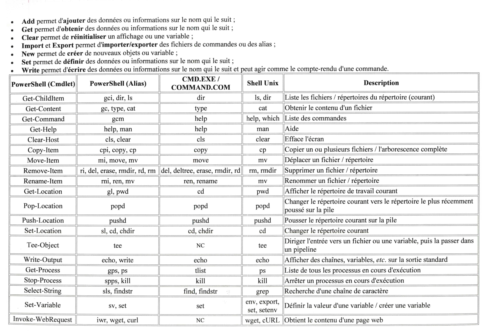

# Présentation de `Windows PowerShell`

`cd` : permet d'ajouter un répertoire à celui déjà ouvert.

- Exemple 1.

	C:\Users\PC-Max\> cd .\Desktop\

Résultat : `C:\Users\PC-Max\Desktop\>`

- Exemple 2.

	C:\Users\PC-Max\> cd \.

Résultat : `C:\>`

- Exemple 3.

	C:\Users\PC-Max\Desktop\> cd ..\

Résultat : `C:\Users\PC-Max\>` Les `..` permettent d'obtenir le dossier parent.

- Exemple 4.

	C:\Users\PC-Max\> cd C:\...

La commande permet d'aller directement dans un nouveau dossier.

`ls` permet d'obtenir la liste des dossiers et des fichiers contenus dans le répertoire ouvert.

Si on tape `C:\> D:`, on quitte le lecture en cours pour le lecteur `D`.

